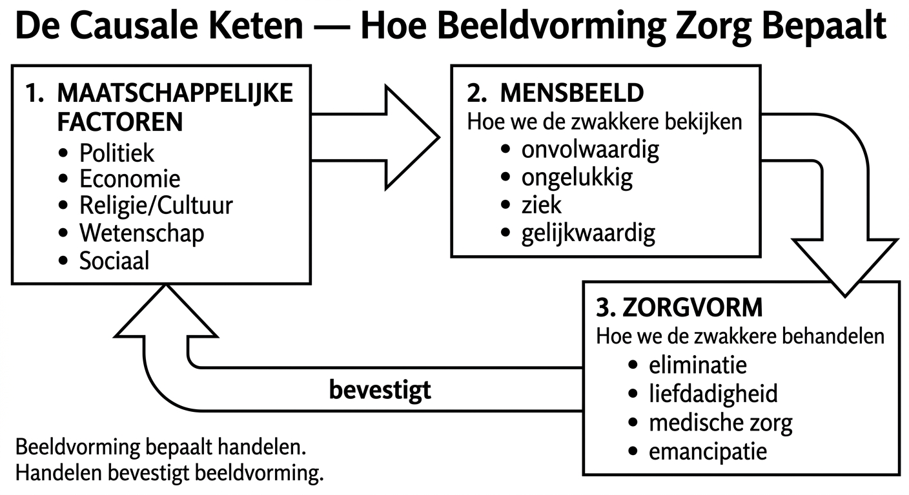

# Kernkader — De Rode Draad van Hoofdstuk 1

## De Centrale Stelling

> *"Opeenvolgende culturen liggen over elkaar geschoven op de bodem van onze samenleving als de sedimenten in de aardkorst"* — Romein-Verschoor, 1974

Dit hoofdstuk gaat **niet** over geschiedenis. Het gaat over **vandaag**. De manier waarop we nu met "zwakkeren" omgaan — mensen met een beperking, mensen in armoede, vluchtelingen, psychiatrische patiënten — is geworteld in historische mensbeelden die zich als sedimenten hebben opgestapeld. Ze zijn niet verdwenen. Ze zijn **verankerd** in wetten, structuren, taalgebruik en onbewuste houdingen.

---

## De Causale Keten (het mechanisme van dit hele hoofdstuk)

**Waarom dit schema cruciaal is:**
- Het mensbeeld wordt niet bepaald door de noden van de persoon, maar door **maatschappelijke factoren** (wie heeft de macht? wat is economisch nuttig? wat zegt de religie/wetenschap?)
- De zorgvorm volgt uit het mensbeeld — niet uit wat de persoon nodig heeft
- De zorgvorm **bevestigt** vervolgens het mensbeeld (vicieuze cirkel)
- Beeldvorming bepaalt handelen. Handelen bevestigt beeldvorming.

> **Zelftest:** Kun je deze keten uitleggen met een concreet voorbeeld? Bv. de Grieks-Romeinse oudheid: welke maatschappelijke factor → welk mensbeeld → welke "zorg"?

---

## De Vier Mensbeelden (Ben Wuyts)

Dit is het organiserende kader van het hele hoofdstuk. Historicus Ben Wuyts onderscheidt vier stereotiepe mensbeelden die de relatie van de samenleving tot "zwakkeren" vatten. **Ze zijn cumulatief** — elk nieuw mensbeeld vervangt het vorige niet, maar voegt zich erbij als een nieuwe laag.

| # | Mensbeeld | Kernidee | Ontstaan in... |
|---|-----------|----------|----------------|
| 1 | **Onvolwaardig** | De zwakkere als niet-mens, bezetene, ballast | Prehistorie & Oudheid |
| 2 | **Ongelukkig** | De zwakkere als zielige sukkelaar die medelijden oproept | Middeleeuwen (christendom) |
| 3 | **Ziek** | De zwakkere als patiënt met een defect dat behandeld moet worden | Verlichting (medische wetenschap) |
| 4 | **Gelijkwaardig** | De zwakkere als volwaardig burger met rechten | Na WO II (mensenrechten) |

> **Opgelet — veelgemaakte fout:** Studenten denken dat mensbeeld 4 de andere drie heeft vervangen. Dat is niet zo. Alle vier leven vandaag **tegelijkertijd** door. De instelling die mensen met een beperking opsluit (1), de liefdadigheidsinzameling (2), de wachtlijst voor diagnostiek (3) — het zijn alle drie hedendaagse uitingen van historische mensbeelden.

---

## De "Vreemde Andere" (Julia Kristeva)

Het vertrekpunt van het hoofdstuk is de filosofische vaststelling dat we de wereld ordenen in **binaire tegenstellingen**:

vreemd/bekend — zwak/sterk — allochtoon/autochtoon — invalide/valide — arm/rijk — vrouw/man — oud/jong ...

Deze tegenstellingen zijn **niet neutraal**:
- Ze weerspiegelen **hiërarchie en machtsverhouding** (de ene pool is altijd "minder" dan de andere)
- Ze creëren een **statisch en determinerend mensbeeld** (eenmaal gelabeld, moeilijk te ontsnappen)
- Ze leiden tot **stereotypen** die de machtsverhoudingen bevestigen

**Waarom dit ertoe doet voor orthopedagogie:** De hulpverlener is zelf product van deze samenleving en haar mensbeelden. Kritisch zijn vereist **kennis** van hoe die mensbeelden zijn ontstaan en hoe ze doorwerken. Dat is de reden waarom dit historisch hoofdstuk bestaat.

---

## Vijf Maatschappelijke Factoren

Het hoofdstuk toont herhaaldelijk hoe vijf factoren het mensbeeld en de zorg vormgeven. Dit zijn de "knoppen" waaraan je kunt draaien bij elke historische periode:

| Factor | Mechanisme | Voorbeeld |
|--------|-----------|-----------|
| **Politiek** | Wie de macht heeft bepaalt wie bestaansrecht heeft | Pater familias heeft staatsplicht kind met handicap te doden |
| **Economie** | Wie productief is heeft waarde; wie dat niet is, is ballast | Industriële Revolutie: fysiek/mentaal zwakkeren raken werk kwijt |
| **Religie/Cultuur** | Geloof bepaalt of lijden een straf, loutering of zegen is | Christendom: handicap als straf van God → culpabilisering |
| **Wetenschap** | Wetenschappelijke theorieën legitimeren mensbeelden | Eugenetica: "wetenschappelijk bewijs" dat zwakzinnigheid erfelijk is |
| **Sociaal** | Sociale structuren (stad vs. platteland) bepalen tolerantie | Dorpsgekken worden geaccepteerd; in de stad worden ze opgesloten |

> **Zelftest:** Kies een historische periode. Kun je voor minstens drie van deze factoren uitleggen hoe ze het mensbeeld beïnvloedden?

---

## De Orthopedagoog in Dit Verhaal

Het hoofdstuk eindigt met een opdracht aan de (toekomstige) hulpverlener:

- Je bent **zelf product** van deze samenleving en haar mensbeelden
- Je bent **bewust én onbewust** beïnvloed door de maatschappelijke grondhoudingen
- Maar je bent ook **mede-vormgever** van die samenleving vanuit je professionele positie
- **Kritische zin** ontstaat alleen op basis van **grondige kennis** van hoe het is en hoe het zou kunnen zijn

→ Dát is waarom dit "geschiedenishoofdstuk" geen geschiedenisles is, maar een **spiegel**.

---

## Navigatie

| Vorig | Volgend |
|-------|---------|
| [Leerarchitectuur](00_Leerarchitectuur.md) | [Historisch Overzicht](02_Historisch_Overzicht.md) |
