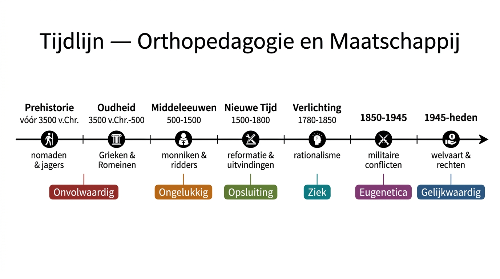

# Historisch Overzicht — Per Periode

> **Studeerinstructie:** Gebruik de **cue-kolom** (links) om jezelf te testen. Dek de rechterhelft af en probeer vanuit het steekwoord de inhoud te reconstrueren. Kom pas daarna controleren.

---

## 1. PREHISTORIE — Tijd van nomaden en jagers (... – 3500 v.Chr.)

### Maatschappelijke context

| Cue | Inhoud |
|-----|--------|
| Levenswijze | Nomadisch bestaan, jagers-verzamelaars. Leven bepaald door natuur en haar grillen. |
| Selectieprincipe | Natuurlijke selectie / "survival of the fittest" (Darwin). Wie niet bijdraagt aan de groep = overbodig → achtergelaten of gedood. |
| Verandering | Nieuwe steentijd (4000-1500 v.Chr.): nomadisch → nederzettingen, eigen voedselproductie. Nieuwe functies: krijgers (leven/dood), priesters/medicijnmannen ("bovennatuurlijke" krachten). |
| Levensverwachting | ~40 jaar; veel sterfte vóór 5 jaar |

### Mensbeeld: **ONVOLWAARDIG / BEZETENE**

| Cue | Inhoud |
|-----|--------|
| Kijk op zwakkeren | Gevaarlijk, besmettelijk, ballast. Beperkt begrip van werkelijkheid → het onverklaarbare wordt toegeschreven aan bezetenheid. |
| Horen ze erbij? | Nee — ze horen niet thuis in de primitieve samenleving. |

### Zorg (of het gebrek daaraan)

| Cue | Inhoud |
|-----|--------|
| Structurele zorg? | **Onbestaande.** Zorg is zeldzaam, intuïtief en instinctief. |
| Toch bewijs van zorg | Trepanatie (schedelboring) = oudste chirurgische ingreep. Doel: geestenuitdrijving? Geneeskunde (hoofdpijn, epilepsie)? Beide mogelijk. |
| Andere vondsten | Skeletten met amputaties (Shanidar, Irak), artrose (La Chapelle-aux-Saints), bundeltjes medicinale planten bij Neanderthalers. |
| Magisch kader | Sjamanen, rotschilderingen als bezweringsrituelen — magisch/mystiek kader om de wereld te begrijpen. |

### Sleutelfiguur

| Wie | Belang |
|-----|--------|
| **Lucy** (Australopithecus afarensis) | 1974, gevonden in Afar (Ethiopië) door Donald Johanson. 3,2 miljoen jaar oud. Oudste en meest complete vroeg-mensachtige (40% skelet). Naam komt van Beatles-liedje "Lucy in the Sky with Diamonds". |

---

## 2. OUDHEID — Tijd van Grieken, Romeinen en goden (3500 v.Chr. – 500 n.Chr.)

### Maatschappelijke context

| Cue | Inhoud |
|-----|--------|
| Naast natuurlijke selectie... | ...komt nu ook **maatschappelijke selectie**. Opkomst stadstaten (Athene, Sparta, Rome). |
| Demografisch motief | Voedselschaarste door slechte landbouwgronden, oorlogen, bevolkingsgroei → verplichte geboortebeperking, doding/te vondeling leggen van "ongewensten". |
| Economisch motief | Rijke families willen erfgoed behouden → liefst één wettige zoon, dochter = dure bruidsschat. Elimineren van "overtollige" kinderen wordt gelegitimeerd. |
| Eugenetisch motief | **Kalokagathia** = Grieks staatsideaal: streven naar schoon, sterk, moreel edel ras. "Mens sana in corpore sano." Wie afwijkt bij geboorte → geen bestaansrecht. |
| Politieke legitimering | Plato, Aristoteles, Seneca: doden van "zwakke" kinderen is wettelijk. **Pater familias** in Rome heeft staatsplicht gehandicapt kind binnen 10 dagen te doden. |
| Christendom | Wordt staatsgodsdienst → religieuze wetten nemen beslissingsrecht over van pater familias. God = schepper van álle mensen → niet meer gedood, maar **niet beter af**. |

### Mensbeeld: **ONVOLWAARDIG / ONGEWENST** (verankerd in wetten)

| Cue | Inhoud |
|-----|--------|
| Wat verandert t.o.v. prehistorie? | Het onvolwaardig mensbeeld wordt nu **wettelijk verankerd** via rechten en wetten. Het is niet meer alleen natuurlijke selectie, maar bewuste, georganiseerde eliminatie. |
| Stigma | Kalokagathia → wie niet beantwoordt aan het schoonheidsideaal is een "minderwaardige burger". Spraakgebrek, lichamelijk tekort = stigma. |

### Zorg

| Cue | Inhoud |
|-----|--------|
| Amper zorg | Kinderen met onzichtbare handicap (doof, dwerggroei, verstandelijke beperking) overleven, maar: "minderwaardig", burgerrechten ontnomen. |
| Lot | Doven = "stom"; dwerggroei = "nar"/"huisdier"; de rest → slavernij, prostitutie, bedelstaf. |
| Uitzondering | Oorlogsinvaliden krijgen enig aanzien + financiële staatssteun (6e eeuw v.Chr.). |
| Asclepius-tempels | Geneestempels: zieken in roes gebracht door muziek en geuren, Asclepius "verschijnt" in dromen. |
| **Hippocrates** | Grondlegger westerse geneeskunde. Tegen magie en bijgeloof. Theorie: ziekte = onevenwicht van 4 lichaamssappen (bloed, slijm, zwarte gal, gele gal). Behandeling: aderlatingen, afzuigen. Basis voor medische ingrepen tot ver in middeleeuwen. |

---

## 3. MIDDELEEUWEN — Tijd van monniken, ridders en gilden (500 – 1500)

### Maatschappelijke context

| Cue | Inhoud |
|-----|--------|
| Kerstening | Christendom domineert (Clovis + bisschoppen → missionering). **Dubbelzinnige houding**: iedereen is kind van God + barmhartigheid, MAAR handicap/armoede = straf van God → schuld bij individu/ouders. |
| Agrarisch → stedelijk | Begin middeleeuwen: gesloten agrarische gemeenschappen, mensen met verstandelijke handicap = deel van gemeenschap ("dorpsgekken"). Daarna: opkomst steden → tolerantie verdwijnt. |
| Steden | Dichtbevolkt, juridische onafhankelijkheid, lichamelijke straffen (galg, schandpaal). Hand afhakken voor stelen, ogen uitsteken voor ontucht → handicap = zichtbaar teken van misdaad. **Stigma bevestigd.** |
| Pestpandemie (1347) | Zwarte Dood: builen, bloedingen, dood binnen 5 dagen. Toegeschreven aan "pestgif" en Gods toorn (niet aan ratten/vlooien). Bijgeloof domineert: bidden, boeteprocessies, poeder van heiligenbeenderen. |
| Nieuwe rijken | Poorters (handelaars) → gasthuizen, godshuizen naast religieuze initiatieven. Gilden organiseren zorginstellingen. |

### Mensbeeld: **ONGELUKKIG** (nieuw, naast onvolwaardig)

| Cue | Inhoud |
|-----|--------|
| Nieuw beeld | De zwakkere als **zielige sukkelaar** die medelijden en liefdadigheid oproept. |
| Mechanisme | Christelijke caritasgedachte: de rijken **hebben de armen nodig** om hun hemel te verdienen. Aalmoes in ruil voor onderdanigheid en dankbaarheid. |
| Gevolg | Sociale structuren blijven onaangetast, machtsverhoudingen gehandhaafd. Liefdadigheid = bevestiging van ongelijkheid, niet oplossing ervan. |

### Zorg: devotie, bijgeloof en kwakzalverij

| Cue | Inhoud |
|-----|--------|
| Religieuze zorg | Kloostergasthuizen (armen, zieken, gebrekkigen). Armenpenningen na zondagsdienst. Armentafels op feestdagen (brood, vlees, bier). |
| Geen structurele zorg | Genezen/revalideren is niet aan de orde — ziekte en lijden = straf of loutering van de ziel. |
| Culpabilisering | Doven → geëxcommuniceerd (kunnen "Woord van God" niet horen). Blindheid → straf voor seksuele zonden. Gehandicapt kind → resultaat van zondige seks (overspel, incest, ...). |
| Geesteszieken | Als dieren in kooien bij stadspoorten. Vanaf ~1390: "sinnelooshuizen"/"dolhuizen" — vastgeketend, voederbak, gat in de grond. Volksremedies: "laten schrikken", "smoren van de dollen" (stikken met kussen). |
| Pestdokter | Iconisch beeld (masker met kruidenneus) — maar waarschijnlijk gebaseerd op **Dottore Becco**, een carnavalskarikatur uit de commedia dell'arte (Doktor Schnabel von Rom, 1656). Niet per se historisch accurate pestdokterkledij. Voorbeeld: **kritische lezing** van geschiedenis is nodig. |

---

## 4. NIEUWE TIJD — Reformatie, ontdekkingsreizen en uitvindingen (1500 – 1800)

### Maatschappelijke context

| Cue | Inhoud |
|-----|--------|
| Humanisme | Mens als rationeel denkend wezen. Nieuwe elite (kooplieden, intellectuelen: Copernicus, Galilei, Erasmus). Kritiek op de Kerk. |
| Reformatie | Erasmus & Luther: kritiek op aflaten, corruptie, ontucht Kerk. Scheuring → protestantisme (lutheranisme, calvinisme). Contrareformatie: jezuïetenorde, inquisitie. Godsdienstoorlogen → Vlaanderen onder streng katholiek + Spaans gezag. |
| Strenge moraal | Zowel humanisten als contrareformisten: wie afwijkt → zondig leven, banden met duivel. "Wisselkinderen" — door duivel verwisseld; sommige ouders gooien pasgeborenen in het vuur. |
| Verstedelijking | Steden volstromen met bezitloze landlieden → bedreiging voor burgerlijke gezag. Maatregelen: registratie van armen, bedelpenning met stadswapen (enkel "echt" arbeidsonbekwamen mogen bedelen). |

### Mensbeeld: onvolwaardig + ongelukkig (ongewijzigd, maar nu met nadruk op opsluiting)

### Zorg: opsluiting en "arbeid adelt"

| Cue | Inhoud |
|-----|--------|
| Opsluiting | Foucault: **"de grote opsluiting"** — armen, bedelaars, gekken systematisch apart gezet. Hôpital Général (Parijs, 1656). In Gent: Rasphuis in Geraard de Duivelsteen (1676) — Brazielhout raspen. |
| Tucht- en werkhuizen | Vrouwen → spinhuizen; mannen → rasphuizen. "Arbeid adelt" + "Ledigheid is des duivels oorkussen". Arbeid als medicijn tegen criminaliteit → eigenlijk **arbeidsuitbuiting als behandeling**. |
| Onderwijs voor doven | Ponce de Léon (1520-1584, Spanje): ontwikkelt gebarentaal voor dove kinderen van aristocratie (gebaseerd op kloostergebaren). 1620: eerste boek over letteralfabet in gebaren (Juan Pablo Bonet). |
| Superioriteitsgevoel | Burgerij + Kerk gebruiken macht om verhoudingen in stand te houden. Wie niet voldoet → opgesloten "ter bescherming van de samenleving". |

---

## 5. VERLICHTING — Rationalisme, positivisme en sensualisme (1780 – 1850)

### Maatschappelijke context

| Cue | Inhoud |
|-----|--------|
| Franse Revolutie (1789) | Einde vorstelijk absolutisme. Volk + burgerij in opstand tegen Koning, adel, Kerk. |
| Sensualisme | **John Locke**: mens = "tabula rasa" (wit blad). Kennis komt via zintuigen (gebaseerd op Aristoteles). → Eerste pedagogische stroming. Kind is leerbaar via zintuiglijke ervaringen. **Maar**: Locke vindt dat zwakzinnigen geen "ratio" hebben en tot "de klasse van de apen" behoren. |
| Rousseau | *Emile* (1762): kind beschermen tegen negatieve maatschappelijke invloeden. Kennis is niet klassegebonden, iedereen wordt gelijk geboren. |
| Industriële Revolutie | Mechanisering → minder vraag naar arbeidskrachten. Lange werkdagen, lage lonen. Vrouwen en kinderen als goedkope krachten. Liefdadigheid door rijke dames = bevestiging van sociale status. |
| Volksonderwijs | Burgerij wil arbeiderskinderen disciplineren via werkscholen. Doel: **geen emancipatie**, maar bevestiging machtsverhoudingen. Contrast met Rousseau en Kant ("opvoeden tot mondigheid"). |

### Mensbeeld: **ZIEK / DEFECT** (nieuw)

| Cue | Inhoud |
|-----|--------|
| Nieuw beeld | Onder impuls van medische wetenschap: de zwakkere wordt **patiënt**. Niet meer bezetene of sukkelaar, maar iemand met een defect dat behandeld moet worden. |
| Wuyts' formulering | "De gehandicapte is een persoon met een defect, een zieke die medische verzorging, revalidatie en orthopedische hulp nodig heeft. Ze worden het best geholpen in instellingen, georganiseerd als ziekenhuizen." |
| Keerzijde | Nadruk op defect, niet op de mens. Mens als patiënt, arts als autoriteit. |

### Zorg: pedagogisch optimisme en institutionalisering

| Cue | Inhoud |
|-----|--------|
| **Diderot** (1713-1784) | Pleit voor opvoedingsmogelijkheden blinde/dove kinderen. Als visueel/auditief kanaal tekortschiet → andere zintuigen ontwikkelen. |
| **Valentin Häuy** (1745-1822) | 1785, Parijs: eerste volksschooltje voor blinde kinderen. Houten/loden letters in papier → reliëf betasten. |
| **Louis Braille** | Leerling van Häuy. Brailleschrift: gebaseerd op nachtschrift van spionnen (Frans leger). Zespuntig → 63 combinaties. |
| **Charles Michel de l'Épée** (1712-1789) | 1770, Parijs: eerste publieke school voor "doofstomme" kinderen. Manuele/Franse methode (gebarentaal). |
| **Samuel Heinicke** (1727-1790) | Duitsland: eerste openbare dovenschool. Orale/klankmethode (denken = spreken). |
| Methodenstrijd | Frans (gebaren) vs. Duits (oraal). 1880: congres kiest voor orale methode. In Vlaanderen: gebarentaal **verboden** tot 1980. Pas daarna: "Totale Communicatie" (synergie). |
| **Victor, de Wilde van Aveyron** | ~1800: verwilderde jongen gevonden. **Pinel**: "ongeneesbare idioot" (achterlijk geboren, daarom achtergelaten). **Itard**: achterlijk geworden door achterlating. Itard probeert heropvoeding (1801-1806): routines, structuur, cognitieve oefeningen. Na 10 jaar: beperkte verbetering, maar bewees **leer- en opvoedbaarheid** van "idiote kinderen". Itard = **eerste orthopedagoog avant la lettre**. |
| **Séguin** (1812-1880) | Eerste schooltje voor zwakzinnige kinderen (Parijs, 1840). Opvoeding van "idioten" = zaak voor **pedagogie**, niet diagnostiek. "Als zij niet willen, dan willen wij voor hen." |
| **Guggenbühl** (1816-1863) | Abendberg (Zwitserland): eerste **residentiële zorg** voor zwakzinnige kinderen. Behandeling van cretinisme (jodiumtekort). |
| Morele behandeling | **William Tuke** (1796, York Retreat, Engeland): geen kettingen maar persoonlijke aandacht, wandelingen, landbouw. **Pinel** (Parijs): krankzinnigen = patiënten, niet bezetenen. Moreel gezag van de arts. **Guislain** (Gent): bevrijdt krankzinnigen uit Duivelsteen, groepeert per ziektebeeld, architectuur als therapie. |

---

## 6. MILITAIRE CONFLICTEN EN VERNIETIGING (1850 – 1945)

### Maatschappelijke context

| Cue | Inhoud |
|-----|--------|
| Crisistijd | Landbouwcrisis (1850), migratiestromen stad, Tweede Industriële Revolutie, epidemieën (cholera, tyfus, pokken, tbc). Armoede + ziekte → criminaliteit + alcoholmisbruik. |
| Schuld bij het individu | Rijken/politici: armoede en ziekte = eigen schuld. Zwakzinnigheid = eigenschap lagere klasse. Erfelijkheidsgedachte ontkiemt. |
| Nationalisme | Patriottisme, "eigen bloed en bodem", afkeer voor wie anders is. Koloniën als bevestiging suprematie blanke man. |
| Sociaal darwinisme | Galton (neef Darwin, grondlegger eugenetica): sociale ongelijkheid = biologisch bepaald. Reproductie van "lagere klassen" moet afgeremd worden. |
| Sterilisatiewetten | VS (1907): eerste sterilisatiewet. >70.000 mensen gesteriliseerd (tbc, syfilis, zwakzinnigen, armen, daklozen, alcoholici...). |
| **Down-syndroom** | Dr. John Langdon Down (1866): "idioten van het Mongoolse type" — gezien als degeneratie van West-Europees ras. Oorzaak volgens hem: slechte levensomstandigheden, incest, alcoholisme. |
| Stamboomstudies | Dugdale (Juke family) & Goddard (Kallikak family): "bewijzen" erfelijkheid van zwakzinnigheid, criminaliteit, ziekte. Enorm populair. |

### Fascisme en eugenetica

| Cue | Inhoud |
|-----|--------|
| Hitler & eugenetica | Sterke staat = sterke bevolking nodig. Eugenetische politiek: sterilisatieprogramma (1935-1945: ~1% Duitse bevolking). |
| Aktion T4 | Euthanasiebevel (okt. 1939): artsen machtigen "ongeneeslijken" te doden. "Endlösung der sozialen Frage." Doding = "genadedood", "verlossing", "barmhartigheid". ~200.000 doden in 5 psychiatrische instellingen. |
| Lebensborn | Himmlers programma: geheime kraamklinieken voor Arische kinderen. Onvoldoende kinderen → ontvoering van "Arisch-ogende" kinderen in bezette gebieden. Hoog gerankt → adoptie door SS-families. Laag → concentratiekampen. In Noorwegen: ~10.000 Lebensborn-kinderen. Na oorlog: gestigmatiseerd, misbruikt, in gestichten. |
| ABBA-link | Frida Lyngstad (ABBA) = Lebensborn-kind uit Noorwegen. |

### Onderwijs en segregatie

| Cue | Inhoud |
|-----|--------|
| Heilpedagogiek | Voorloper orthopedagogie. Dubbele betekenis: "heilen" (genezen door opvoeding) + "heil" (religieus: zedelijk gedrag stimuleren). |
| Leerplicht België (1914) | 25 jaar na wet op kinderarbeid. Alle kinderen naar school tot 14 jaar. Maar: zittenblijvers → speciale klassen / "debielenscholen". |
| **Binet & Simon** (1905) | IQ-test: bedoeld om zwakke leerlingen te ontdekken voor extra begeleiding. In praktijk: instrument dat **segregatie rechtvaardigt**. |
| België als koploper | Demoor, Decroly, Broeders van Liefde → aparte scholen en instituten voor kinderen met handicap. |

---

## 7. REHABILITATIE, WELVAART EN VERZORGINGSSTAAT (1945 – ...)

### Maatschappelijke context

| Cue | Inhoud |
|-----|--------|
| Na WO II | Europa verwoest, 50-70 miljoen doden. Heropbouw. VN opgericht (1945). |
| Universele Verklaring Rechten van de Mens (1948) | Alle vormen van discriminatie bestrijden. Basis voor emancipatiebewegingen. |
| Sociaal Pact (1944, België) | Overheid + werkgevers + werknemers: lonen gekoppeld aan index, cao's, RSZ (sociale zekerheid). Eerste sociaal vangnet. België → verzorgingsstaat. |
| Decennia in vogelvlucht | Jaren 60: hoogconjunctuur, revoltes '68, maanlanding. Jaren 70: oliecrisis, feminisme. Jaren 80: bezuiniging (Martens), staatshervormingen. 1989: val Berlijnse Muur. Jaren 90: schandalen (Agusta, Dutroux, dioxine), Vlaams Blok. 2000+: euro, globalisering, ICT-revolutie. |

### Mensbeeld: **GELIJKWAARDIG** (nieuw)

| Cue | Inhoud |
|-----|--------|
| Nieuw beeld | Zwakkeren zijn **volwaardige burgers** die rechtmatig deel uitmaken van de samenleving. Nadruk op burgerschap, eigen identiteit, zelf vorm geven aan eigen leven. |
| Basis | Rechten van de mens, antidiscriminatie, focus op **participatie** i.p.v. pathologie of stoornis. |

### Zorgontwikkelingen

| Cue | Inhoud |
|-----|--------|
| Normalisatieprincipe | Scandinavië (jaren 50): mensen met verstandelijke beperkingen → bestaan "zo dicht bij het normale als mogelijk". |
| VN-Verdrag (2006) | VN-Verdrag voor gelijke rechten personen met handicap. Door België geratificeerd in 2009. Meest gezaghebbende instrument vandaag. |
| Buitengewoon onderwijs (1970) | Wettelijk geregeld in België. Bedoeld als gespecialiseerd onderwijs in aparte scholen. Maar: aantal leerlingen verdubbeld tegen 2015, 1 op 10 twaalfjarige jongens in BuO. |
| M-decreet (2015) | Recht op inschrijving gewone school + redelijke aanpassingen + ondersteuning. Veel weerstand, instroom blijft uit. Vervangen door **Leersteundecreet** (2021). |
| Jeugdzorg | Wet jeugdbescherming (1965): preventie, jeugdrechtbanken, 18 jaar als grens. MOF'ers (misdrijf) en POS'ers (problematische opvoedingssituatie). 2013: decreet integrale jeugdzorg. |
| VAPH | Vlaams Agentschap voor Personen met een Handicap (voorheen VFSIPH, 1990). Integratie als doel → doelgroepenbeleid + afbouw instituten. Ambulante dienstverlening groeit. |
| IVRK (1989) | Internationaal Verdrag Rechten van het Kind: 41 kinderrechten (bescherming, voorzieningen, overleving, inspraak). |
| Vermaatschappelijking | Perspectief 2020 (Vandeurzen): zorg zo veel mogelijk in en door de samenleving. Vraaggestuurde zorg, maximale eigen regie. |
| Maar... | Wachtlijsten, handicaparchipel (parallel circuit), actieve welvaartstaat ("jobs, jobs, jobs"), vergrijzing, toenemende armoede en ongelijkheid. |

---

## Navigatie

| Vorig | Volgend |
|-------|---------|
| [Kernkader](01_Kernkader.md) | [Vergelijkingsmatrix](03_Vergelijkingsmatrix.md) |
