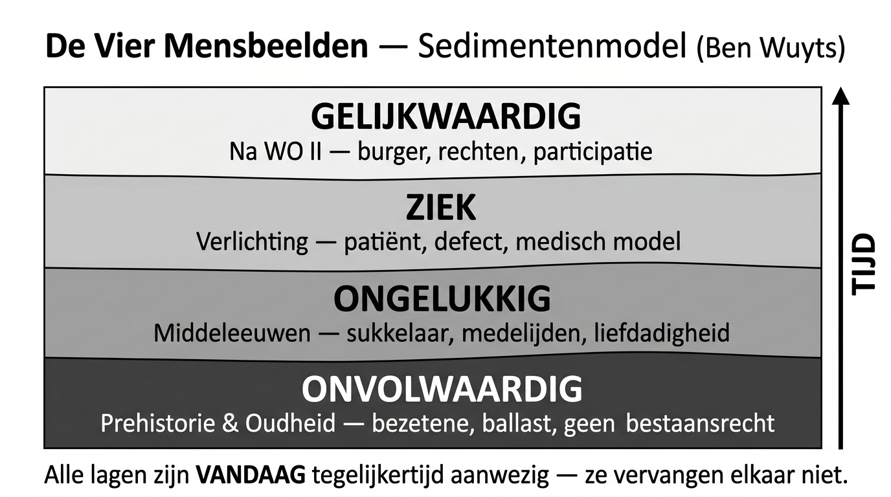

# Vergelijkingsmatrix — De Vier Mensbeelden (Ben Wuyts)

> **Studeerinstructie:** Dit is je belangrijkste discriminatie-instrument. Oefen door de matrix vanuit je geheugen in te vullen. Print deze pagina, dek kolommen af, en reconstrueer. Op het examen moet je deze vier mensbeelden vlot kunnen onderscheiden, aan periodes koppelen, en met actuele voorbeelden illustreren.

---

## Volledige Matrix

| Dimensie | 1. ONVOLWAARDIG | 2. ONGELUKKIG | 3. ZIEK | 4. GELIJKWAARDIG |
|----------|-----------------|---------------|---------|------------------|
| **Hoe wordt de zwakkere gezien?** | Onmens, abnormaal, bezetene, ballast, gevaarlijk | Zielige sukkelaar, ongelukkige, Gods uitverkorene | Patiënt met een defect, stoornis of tekort | Volwaardig burger, medemens met rechten |
| **Status** | Geen bestaansrecht, geen rechten, als dier behandeld | Voorwerp van medelijden en barmhartigheid | Object van medische studie en behandeling | Rechtmatig lid van de samenleving |
| **Motief/drijfveer** | Angst, onwetendheid, beperkt wereldbeeld | Caritas, liefdadigheid, hemel verdienen. Statisch godsbeeld | Ontluikende wetenschap, ratio voorop, mens centraal i.p.v. God | Mensenrechten, antidiscriminatie, participatie |
| **Zorgvorm** | Geen of destructief: doding, opsluiting, verbanning, slavernij, mishandeling | Caritatief: aalmoezen, geen structurele hulp, afhankelijk van goedheid anderen | Medisch: revalidatie, behandelen, herstellen. Aparte tehuizen, scholen, instituten | Emanciperend: in de samenleving, gericht op kwaliteit van leven, inclusie |
| **Ontstaan in...** | Prehistorie & Oudheid | Middeleeuwen (christendom) | Verlichting (medische wetenschap) | Na WO II (VN, mensenrechten) |
| **Leeft vandaag voort als...** | Opsluiting geïnterneerden, ontoegankelijke publieke ruimte, prenatale selectie | Crowdfunding voor zorg, vondelingenschuif, liefdadigheidsacties | Wachtlijsten voor diagnose, medisch model in residentiële zorg, psychiatrie | M-decreet/Leersteundecreet, VN-Verdrag, vermaatschappelijking van zorg |

---

## Discriminatievragen (oefen hiermee)

Welk mensbeeld herken je in elk van deze situaties? Noteer je antwoord en **onderbouw waarom**.

| # | Situatie | Mensbeeld? | Waarom? |
|---|----------|-----------|---------|
| 1 | Een school voor buitengewoon onderwijs georganiseerd als een "totaalinstelling" waar kinderen wonen, leren en ontspannen binnen dezelfde muren | _______ | _______ |
| 2 | Een buurtprotest tegen de komst van een asielcentrum uit angst voor "overlast" | _______ | _______ |
| 3 | Een crowdfunding-actie om een rolstoeltoegankelijke bus te kopen voor een instelling | _______ | _______ |
| 4 | Een persoon met Down-syndroom die naar het gewone onderwijs gaat in Italië | _______ | _______ |
| 5 | Een psychiatrische patiënt die gefixeerd wordt aan zijn bed | _______ | _______ |
| 6 | Prenatale diagnostiek (NIPT) die leidt tot abortus bij Down-syndroom | _______ | _______ |
| 7 | Een werkgever die een sollicitant niet uitnodigt omdat die een handicap vermeldde | _______ | _______ |
| 8 | De vzw Moeders voor Moeders die moeders met een hoofddoek weigert | _______ | _______ |

> **Sleutel:** (1) Ziek (medisch model, totaalinstelling) (2) Onvolwaardig (angst, uitsluiting) (3) Ongelukkig (liefdadigheid i.p.v. structurele oplossing) (4) Gelijkwaardig (inclusie) (5) Onvolwaardig + Ziek (opsluiting + medisch) (6) Onvolwaardig (selectie op "minderwaardig" leven) (7) Onvolwaardig (discriminatie, geen bestaansrecht op arbeidsmarkt) (8) Ongelukkig (selectieve liefdadigheid, machtsverhoudingen)

---

## Het Cruciale Inzicht: Sedimenten, Geen Stappen

> **Niet zo:** Onvolwaardig → Ongelukkig → Ziek → Gelijkwaardig (alsof het ene het andere vervangt)
>
> **Wel zo:** Alle lagen zijn VANDAAG tegelijkertijd aanwezig. Ze stapelen zich op als sedimenten.

---

## Blanco Oefenmatrix

Vul in vanuit je geheugen. Controleer daarna met de matrix hierboven.

| Dimensie | 1. __________ | 2. __________ | 3. __________ | 4. __________ |
|----------|---------------|---------------|---------------|---------------|
| **Hoe wordt de zwakkere gezien?** | | | | |
| **Status** | | | | |
| **Motief/drijfveer** | | | | |
| **Zorgvorm** | | | | |
| **Ontstaan in...** | | | | |
| **Leeft vandaag voort als...** | | | | |

---

## Navigatie

| Vorig | Volgend |
|-------|---------|
| [Historisch Overzicht](02_Historisch_Overzicht.md) | [Verleden is Heden](04_Verleden_is_Heden.md) |
