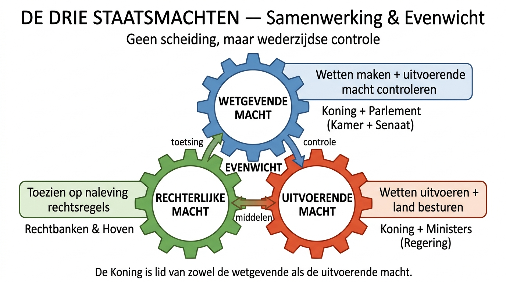

# KERNKADER — Het Belgisch Rechtssysteem in Drie Lagen

> **Leeswijzer:** Dit document is het conceptueel skelet. Begrijp eerst deze structuur — alle details uit de andere bestanden hangen hieraan op. Probeer na het lezen dit schema uit het hoofd te tekenen.

---

## De Grote Vraag: Waarom Recht?

Samenleven vraagt meer dan goede wil. Recht **structureert, organiseert en beschermt** het maatschappelijk leven door rechtsregels die:

- iets **opleggen**, **verbieden**, of **toelaten**
- voor iedereen in gelijkaardige omstandigheden **gelijk** zijn
- door de overheid **afdwingbaar** zijn → dit zorgt voor **rechtszekerheid**

> ⚠️ Recht is meer dan regels — het weerspiegelt de **waarden en normen** van een maatschappij.

---

## LAAG 1 — De Structuur van de Staat

### België = Erfelijke Federale Monarchie

| Kenmerk | Betekenis |
|---|---|
| **Monarchie** | Staatshoofd = koning (geen verkozen president) |
| **Erfelijk** | Opvolging: oudste zoon/dochter |
| **Federaal** | Macht verdeeld over meerdere niveaus |

**Waarom federaal?** Door historische verschillen in taal, onderwijs en economie evolueerde België van eenheidsstaat → federale staat. Gevolg: bevoegdheden zijn **versnipperd** over federaal, gemeenschappen, gewesten, provincies en gemeenten.

### De Drie Staatsmachten — Samenwerking, Geen Scheiding



<details>
<summary>Tekstversie van bovenstaand schema</summary>

```
┌─────────────────┐     ┌─────────────────┐     ┌─────────────────┐
│   WETGEVENDE     │     │  UITVOERENDE     │     │  RECHTERLIJKE   │
│     MACHT        │◄───►│    MACHT         │◄───►│    MACHT        │
│                  │     │                  │     │                 │
│ Wetten maken     │     │ Wetten uitvoeren │     │ Toezien op      │
│ + uitvoerende    │     │ Land besturen    │     │ naleving        │
│   macht          │     │                  │     │                 │
│   controleren    │     │                  │     │                 │
│                  │     │                  │     │                 │
│ Wie: Koning +    │     │ Wie: Koning +    │     │ Wie: Recht-     │
│ Parlement        │     │ Ministers         │     │ banken & Hoven  │
│ (Kamer + Senaat) │     │ (= Regering)     │     │                 │
└─────────────────┘     └─────────────────┘     └─────────────────┘
         ▲                       ▲                       ▲
         └───────────────────────┼───────────────────────┘
                    EVENWICHT & CONTROLE
```
</details>

**Drempelconcept:** Spreek niet over "scheiding" maar over **samenwerking** der machten. Ze oefenen hun functie onafhankelijk uit, maar houden elkaar in **evenwicht** — zodat geen enkele macht te veel invloed krijgt.

<details>
<summary>🔍 Waarom dit ertoe doet: het asielvoorbeeld</summary>

1. **Wetgevende macht** stelt voorwaarden voor asiel op + richt de Raad voor Vreemdelingenbetwistingen op
2. **Uitvoerende macht** (minister) benoemt de rechters volgens de wettelijke regels
3. **Rechterlijke macht** (Raad) beslist onafhankelijk of asielregels correct zijn toegepast

Wanneer de regering (2025) rechters voor slechts 5 jaar wil benoemen (i.p.v. levenslang) en quota wil opleggen, komt de **onafhankelijkheid** van de rechterlijke macht onder druk. Dát is waarom het evenwicht kwetsbaar en cruciaal is.
</details>

### Rechtsbescherming: België als Democratische Rechtsstaat

**Rechtsstaat** = ook de **overheid** moet zich aan de rechtsregels houden.

**Democratisch** = rechtsregels komen tot stand door meerderheidsstemming:
- Voldoende parlementsleden aanwezig (quorum)
- 50% + 1 van de aanwezigen stemt vóór
- Nieuwe regels mogen **geen inbreuk** plegen op grondrechten

Twee speciale instellingen bewaken dit systeem (ze maken **niet** deel uit van de rechterlijke macht, maar dragen wel bij aan rechtsbescherming):

| Instelling | Functie |
|---|---|
| **Grondwettelijk Hof** | Toetst of wetten het gelijkheids- en non-discriminatiebeginsel respecteren. Kan wetten **vernietigen** (binnen 6 maanden na publicatie in BS). Kan ook advies geven vóór de wet er is. |
| **Raad van State** | Twee afdelingen: **Wetgeving** (advies over wettigheid van nieuwe regelgeving) + **Bestuursrechtspraak** (beroepen tegen eenzijdige overheidsbeslissingen, bv. benoeming, intrekking subsidies) |

---

## LAAG 2 — De Indeling van het Recht

### Publiekrecht vs. Privaatrecht

| | Publiekrecht | Privaatrecht |
|---|---|---|
| **Regelt** | Verhouding overheid ↔ burgers + organisatie van het land | Verhouding burgers onderling |
| **Voorbeeld** | Grondwet, strafrecht | Familierecht, verbintenissenrecht |

### Drie Soorten Rechtsregels — Van Absoluut tot Flexibel

```
OPENBARE ORDE          DWINGEND RECHT          AANVULLEND RECHT
━━━━━━━━━━━━━          ━━━━━━━━━━━━━━          ━━━━━━━━━━━━━━━━
Automatisch toege-     Beschermt zwakkere      Uitgangspunt, maar
past. Niemand kan      partij (huurders,       je mag ervan afwijken
ervan afwijken, ook    werknemers, consu-      als je dat wil.
de rechtbank niet.     menten). Beschermde
                       partij kan schending
                       aankaarten bij
                       rechtbank.

Bv: recht op leven,    Bv: huurwaarborg        Bv: huwelijksver-
abortusregels          max. 3 maanden huur     mogensrecht — koppel
                                               kan kiezen voor
                                               scheiding van
                                               goederen i.p.v.
                                               wettelijk stelsel
```

> 💡 **Examenvalkuil:** Het is niet altijd duidelijk welk type een regel is — soms staat het in de wet, vaak niet. Bij twijfel: raadpleeg een jurist.

---

## LAAG 3 — De Bronnen van het Recht

Waar vind je het recht terug? Er zijn vijf bronnen, in een **hiërarchie** van hoog naar laag:

### 1. Wetgeving (hoogste bron)

```
                    ┌──────────────┐
                    │  GRONDWET    │  ← Meest fundamenteel
                    └──────┬───────┘
                           │
              ┌────────────┼────────────┐
              │            │            │
        ┌─────┴─────┐ ┌───┴────┐ ┌─────┴──────┐
        │  WETTEN   │ │DECRETEN│ │ORDONNANTIES │
        │ (federaal)│ │(Vl/Fr/ │ │(Brussels    │
        │           │ │Dt Gem, │ │ HG)         │
        │           │ │Vl/W    │ │             │
        │           │ │Gewest) │ │             │
        └─────┬─────┘ └───┬────┘ └─────┬──────┘
              │      GELIJKE WAARDE    │
              └────────────┼───────────┘
                           │
              ┌────────────┼────────────┐
              │                         │
    ┌─────────┴──────────┐  ┌──────────┴──────────┐
    │ KB / MB            │  │ Besluiten deelstaat- │
    │ (Koninklijk /      │  │ elijke regering      │
    │  Ministerieel      │  │                      │
    │  Besluit)          │  │                      │
    └────────────────────┘  └─────────────────────┘
                           │
              ┌────────────┼────────────┐
              │                         │
    ┌─────────┴──────────┐  ┌──────────┴──────────┐
    │ Provinciale        │  │ Gemeentelijke        │
    │ reglementen        │  │ reglementen           │
    └────────────────────┘  └─────────────────────┘
```

**Totstandkoming van wetgeving:**
Wetsvoorstel (parlementslid) of wetsontwerp (minister) → parlementaire commissie → parlement stemt (meerderheid) → bekrachtiging door koning + minister → publicatie in Belgisch Staatsblad → **inwerkingtreding 10 dagen later** (tenzij anders bepaald)

### 2. Rechtspraak

Het geheel van rechterlijke uitspraken. In België heeft rechtspraak **niet dezelfde waarde als wetgeving** (anders dan in de VS/VK). Wél heeft rechtspraak van hogere rechtscolleges **precedentwaarde** — lagere rechters zijn niet gebonden maar houden er in de praktijk rekening mee.

### 3. Rechtsleer

Wetenschappelijke publicaties van rechtsgeleerden (handboeken, tijdschriften). Geen rechtstreekse bron, maar beïnvloedt wel wetgeving en rechtspraak.

### 4. Gewoonte

Ongeschreven maar langdurig toegepaste gebruiken (bv. de koning stelt een formateur aan na verkiezingen). Niet elke gewoonte is een rechtsbron — alleen juridisch relevante.

### 5. Algemene Rechtsbeginselen

Fundamentele normen waarop de samenleving rust (bv. "iedereen wordt geacht de wet te kennen", billijkheid). Rechters kunnen zich erop beroepen om de hardheid van een rechtsregel te verzachten.

---

## Zelftest: Kun je dit kernkader reproduceren?

Probeer zonder terug te kijken:

1. Teken de drie staatsmachten en hun functies
2. Noem het verschil tussen openbare orde, dwingend recht en aanvullend recht — met telkens één voorbeeld
3. Zet de vijf rechtsbronnen in de juiste hiërarchie
4. Leg uit waarom je spreekt over "samenwerking" en niet "scheiding" der machten
5. Wat is het verschil tussen een wet, een decreet en een ordonnantie?
