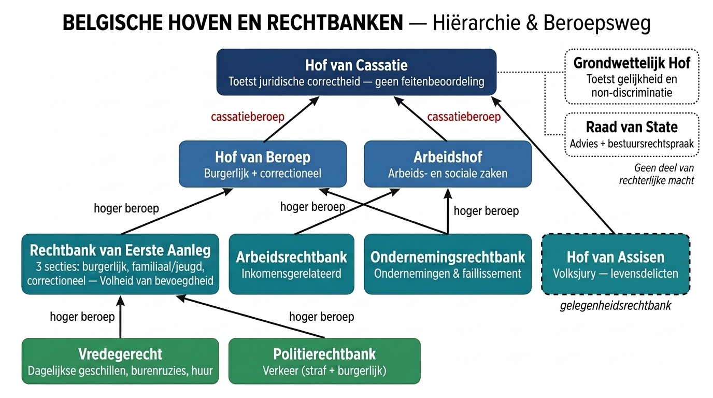
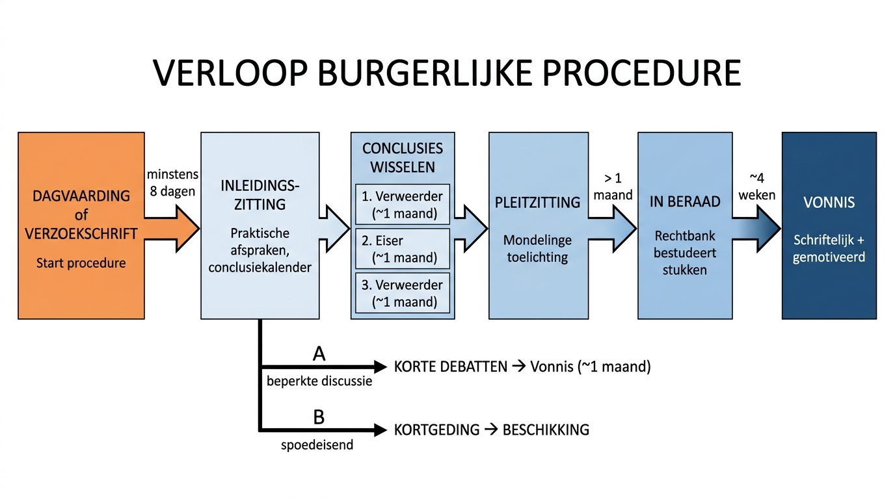

# HOVEN, RECHTBANKEN & PROCEDURES — Gedetailleerd Overzicht

> **Studeerinstructie:** Dek de rechterkolom af. Lees de cue-vraag links en probeer het antwoord uit je geheugen te reconstrueren. Pas daarna controleer je.

---

## 1. De Belgische Hoven en Rechtbanken — Hiërarchie



<details>
<summary>Tekstversie van bovenstaand schema</summary>

```
                    ┌───────────────────┐
                    │  HOF VAN CASSATIE │  ← Buitengewoon rechtsmiddel
                    └────────┬──────────┘
                             │
         ┌───────────────────┼───────────────────┐
         │                   │                   │
┌────────┴────────┐ ┌───────┴────────┐          │
│  HOF VAN BEROEP │ │  ARBEIDSHOF    │          │
└────────┬────────┘ └───────┬────────┘          │
         │                   │                   │
         │    HOGER BEROEP ──┘                   │
         │                                       │
┌────────┴──────────────────────────────────────┐│
│              EERSTE AANLEG                     ││
│                                                ││
│  ┌──────────────┐  ┌───────────────────┐      ││
│  │ RECHTBANK    │  │ ARBEIDS-          │      ││
│  │ VAN EERSTE   │  │ RECHTBANK         │      ││
│  │ AANLEG       │  │ → Arbeidshof      │      ││
│  │ → Hof van    │  └───────────────────┘      ││
│  │   Beroep     │  ┌───────────────────┐      ││
│  │              │  │ ONDERNEMINGS-     │      ││
│  │              │  │ RECHTBANK         │      ││
│  │              │  │ → Hof van Beroep  │      ││
│  └──────────────┘  └───────────────────┘      ││
│                                                ││
│  ┌──────────────┐  ┌───────────────────┐      ││
│  │ VREDERECHT   │  │ POLITIE-          │◄─────┘│
│  │ → RvEA       │  │ RECHTBANK         │       │
│  └──────────────┘  │ → RvEA            │       │
│                    └───────────────────┘       │
│  ┌─────────────────────────────────────┐       │
│  │ HOF VAN ASSISEN (gelegenheids-      │───────┘
│  │ rechtbank) → cassatie               │
│  └─────────────────────────────────────┘
└────────────────────────────────────────────────┘

Buiten de rechterlijke macht:
  • Grondwettelijk Hof — toetst gelijkheid & non-discriminatie
  • Raad van State — advies + bestuursrechtspraak
```
</details>

---

## 2. Elke Rechtbank in Detail — Cue-Kolom

### Vredegerecht

| Cue | Inhoud |
|---|---|
| **Wie zit er?** | De **vrederechter** — "dichtstbij de burger" |
| **Welke zaken?** | Dagelijkse geschillen: burenruzies (lawaai, boomtakken), huurproblemen, appartementsgeschillen, onbetaalde ziekenhuisfacturen, beschermingsmaatregelen voor personen met psychische problemen |
| **Bijzondere bevoegdheid?** | Alle zaken < **€5.000** die niet exclusief bij een andere rechtbank thuishoren |
| **Exclusieve bevoegdheid?** | Ja, bv. onteigeningen — alleen de vrederechter mag dit behandelen |
| **Hoger beroep?** | Naar de rechtbank van eerste aanleg (vanaf €2.000) |

### Politierechtbank

| Cue | Inhoud |
|---|---|
| **Twee soorten zittingen?** | **Strafrechtelijk** (verkeersovertredingen: snelheid, alcohol) + **Burgerlijk** (verkeersgeschillen: wie betaalt schade bij ongeval?) |
| **Kernbevoegdheid?** | Alle vorderingen die verband houden met **verkeer** |
| **Verschil straf/burgerlijk?** | Strafzitting: bescherming van de samenleving. Burgerlijke zitting: oplossen van discussie tussen partijen over verkeersschade |
| **Hoger beroep?** | Naar de rechtbank van eerste aanleg (vanaf €2.000) |

### Ondernemingsrechtbank

| Cue | Inhoud |
|---|---|
| **Welke zaken?** | Geschillen tussen ondernemingen, onderneming ↔ consument, faillissementen, aandeelhoudersconflicten, merkbescherming |
| **Relevantie voor hulpverlener?** | Cliënt met eenmanszaak in financiële problemen, of aannemer die failliet ging na bouwwerk |
| **Samenstelling?** | 3 rechters: 1 beroepsrechter + 2 rechters in ondernemingszaken (uit het bedrijfsleven) |
| **Bijzondere of exclusieve bevoegdheid?** | Bijzonder — de rechtbank van eerste aanleg mag dezelfde zaken ook behandelen |

### Arbeidsrechtbank

| Cue | Inhoud |
|---|---|
| **Welke zaken?** | Alle **inkomensgerelateerde** zaken (breed): arbeidsrelaties, arbeidsongevallen, beroepsziekten, sociale zekerheid, collectieve schuldenregeling, dienstencheques, pensioenen |
| **Relevantie voor hulpverlener?** | Cliënt onterecht ontslagen, discussie over ziekte-uitkering, probleem met schuldbemiddelaar |
| **Samenstelling (soms)?** | 3 rechters: 1 beroepsrechter + 1 sociale rechter-werknemer + 1 sociale rechter-werkgever |
| **Bijstaan door?** | Advocaat óf **vakbondsvertegenwoordiger** (uitzondering!) |

### Rechtbank van Eerste Aanleg

| Cue | Inhoud |
|---|---|
| **Bijzonder kenmerk?** | **Volheid van bevoegdheid** (algemene bevoegdheid) — mag in principe alles behandelen, behalve exclusieve bevoegdheden van andere rechtbanken |
| **Drie secties?** | **Burgerlijk** (schade door huisdier, verzekering, lening) · **Familiaal/Jeugd** (echtscheiding, omgangsrecht, afstamming, jeugddelicten, VOS) · **Correctioneel** (drughandel, verkrachting, geweld, diefstal) |
| **Dubbele functie?** | Behandelt zaken in **eerste aanleg** + zaken in **graad van beroep** (tegen beslissingen vrederechter/politierechtbank) |
| **Let op!** | Beroep via RvEA → daarna GEEN tweede beroep bij hof van beroep meer mogelijk (wel cassatie) |
| **Familierechter: persoonlijk verschijnen?** | Ja — partijen moeten meestal zelf aanwezig zijn |

### Hof van Assisen

| Cue | Inhoud |
|---|---|
| **Wat voor rechtbank?** | **Gelegenheidsrechtbank** (niet permanent) |
| **Welke zaken?** | Ernstige strafzaken: levensdelicten (moord), politieke misdrijven |
| **Samenstelling?** | 3 beroepsrechters (voorzitter + 2 assessoren) + **volksjury** van 12 gelote Belgen |
| **Wie beslist over schuld?** | De **volksjury** |
| **Wie beslist over straf?** | Volksjury **samen met** beroepsrechters |

---

## 3. Bevoegdheid — Welke Rechtbank?

### Materiële bevoegdheid (= welk soort zaak)

| Type | Betekenis | Voorbeeld |
|---|---|---|
| **Uitsluitend** (exclusief) | Slechts **één** rechtbank mag dit behandelen | Onteigeningen → alleen vrederechter |
| **Bijzonder** | Rechtbank is bevoegd, maar een andere mag het ook | Onderneming ↔ consument → ondernemingsrechtbank óf rechtbank van eerste aanleg |

### Territoriale bevoegdheid (= welke locatie)

**Algemene regel:** De rechter van de **woonplaats van de verweerder** (= degene die gedagvaard wordt) is bevoegd.

---

## 4. Soorten Procedures — Beslisboom

```
                    ┌──────────┐
                    │ GESCHIL  │
                    └────┬─────┘
                         │
         ┌───────────────┼───────────────┐
         │               │               │
    ┌────┴────┐    ┌─────┴─────┐   ┌─────┴──────────┐
    │GERECHTE-│    │ADMINISTRA-│   │ALTERNATIEVE     │
    │LIJK     │    │TIEF       │   │GESCHILLEN-      │
    │         │    │           │   │OPLOSSING        │
    └────┬────┘    └─────┬─────┘   └─────┬───────────┘
         │               │               │
    ┌────┴────┐    ┌─────┴─────┐   ┌─────┼──────────┐
    │• Burger-│    │• Jurisdic-│   │     │          │
    │  lijk   │    │  tioneel  │   │Bemid-│Arbi-   │Verzoe-
    │• Straf- │    │  beroep   │   │deling│trage   │ning
    │  rechte-│    │  (rechter)│   │      │        │
    │  lijk   │    │• Bestuur- │   │      │        │
    │         │    │  lijk     │   │      │        │
    │         │    │  beroep   │   │      │        │
    │         │    │  (bestuur)│   │      │        │
    └─────────┘    └───────────┘   └──────┴────────┘
```

### 4.1 Administratieve Procedures

| Cue | Inhoud |
|---|---|
| **Beschermt tegen?** | Beslissingen van de **overheid** |
| **Jurisdictioneel beroep — wat?** | Procedure bij een **rechter**: vraag om overheidsbeslissing te **vernietigen** of te **schorsen** |
| **Jurisdictioneel beroep — waar?** | Gewone rechtbanken óf bestuursrechter (bv. Raad voor Vreemdelingenbetwistingen, Raad voor Vergunningsbetwistingen) |
| **Jurisdictioneel beroep — termijn?** | **60 dagen** na bekendmaking/kennisgeving |
| **Wanneer vernietigen?** | Onbevoegde instantie óf formele fouten (bv. geen motivering) |
| **Bestuurlijk beroep — wat?** | Verzet bij het **bestuur zelf** of het **hiërarchisch hoger bestuur** om de beslissing te laten intrekken, wijzigen of vernietigen |
| **Voorbeeld?** | GAS-boete betwisten bij hiërarchisch hoger bestuur boven de GAS-ambtenaar |
| **⚠️ Verwar niet met…** | "Hoger beroep" in gerechtelijke procedures — dat is iets anders! |

### 4.2 Alternatieve Geschillenoplossing

| Cue | Inhoud |
|---|---|
| **Bemiddeling — wat?** | Vertrouwelijk, vrijwillig overleg met een onafhankelijke bemiddelaar die **geen beslissing neemt** maar communicatie faciliteert |
| **Gerechtelijke bemiddeling?** | Tijdens een lopende procedure — rechter stelt bemiddelaar aan, of neemt zelf verzoenende rol op (bv. KMS) |
| **Buitengerechtelijke bemiddeling?** | Zonder tussenkomst van rechtbank — partijen wenden zich rechtstreeks tot bemiddelaar |
| **Akkoord bereikt — dan?** | Partijen kunnen akkoord laten **homologeren** door rechter → uitvoerbaar zoals een vonnis |
| **Geen akkoord — dan?** | Inhoud bemiddelingsgesprekken mag **niet** gebruikt worden in latere gerechtelijke procedure |
| **Voordelen vs. rechtbank?** | Sneller, goedkoper, meer controle, ook niet-juridische aspecten (emoties, relaties) |
| **Arbitrage — wat?** | Partijen leggen geschil voor aan onafhankelijke **arbiter** (scheidsrechter) die **bindend beslist** |
| **Arbitrage — wanneer?** | Alleen over rechten waar je vrij over kunt beschikken — vaakst tussen ondernemers |
| **Verzoening via rechtbank?** | Verzoek bij vrederechter of RvEA **zonder** gerechtelijke procedure — rechtbank probeert partijen tot akkoord te brengen. **Gratis.** |

### 4.3 Burgerlijke Gerechtelijke Procedure



<details>
<summary>Tekstversie van bovenstaand schema</summary>

```
DAGVAARDING/VERZOEKSCHRIFT
    │ (minstens 8 dagen)
    ▼
INLEIDINGSZITTING ──┬──► KORTE DEBATTEN → Vonnis (~1 maand)
    │               │     (beperkte discussie)
    │               └──► KORTGEDING → BESCHIKKING
    ▼                     (spoedeisend)
CONCLUSIES WISSELEN
  1. Verweerder (~1 maand)
  2. Eiser (~1 maand)
  3. Verweerder (~1 maand)
    │
    ▼
PLEITZITTING (mondelinge toelichting)
    │ (> 1 maand)
    ▼
IN BERAAD (rechtbank bestudeert stukken)
    │ (~4 weken)
    ▼
VONNIS (schriftelijk + gemotiveerd)
```
</details>

| Stap | Wat gebeurt er? |
|---|---|
| **1. Start** | **Dagvaarding** (via gerechtsdeurwaarder) of **verzoekschrift** |
| | Bevat: namen partijen, reden rechtszaak, vordering, rechtbank + datum |
| **2. Inleidingszitting** | Minstens **8 dagen** na dagvaarding. Meestal: praktische afspraken, uitstel, conclusiekalender |
| **3. Conclusies wisselen** | Verweerder → eiser → verweerder (telkens ~1 maand) — schriftelijke standpunten |
| **4. Pleitzitting** | Partijen lichten standpunten mondeling toe. Rechtbank kan vragen stellen |
| **5. In beraad** | Rechtbank bestudeert alle stukken en neemt beslissing |
| **6. Vonnis** | Schriftelijke, **gemotiveerde** beslissing |

**Uitzonderingen op dit standaardverloop:**

| Situatie | Wat dan? |
|---|---|
| **Beperkte discussie** of aanstelling deskundige | Behandeling bij **korte debatten** op de inleidingszitting → vonnis na ~1 maand |
| **Dringende zaak** (bv. voorlopig verblijf kinderen bij echtscheiding) | Rechtbank neemt zaak al op inleidingszitting in beraad |
| **Spoedeisend** (bv. gebouw op instorten, DNA-staal voor begrafenis) | **Kortgeding** — snelle voorlopige beslissing, heet een **beschikking** (geen vonnis) |

---

## 5. Rechtsmiddelen — Beslissing Aanvechten

| Rechtsmiddel | Type | Wat? | Waar? | Voorwaarde |
|---|---|---|---|---|
| **Hoger beroep** | Gewoon | Hogere rechter behandelt zaak **helemaal opnieuw** | Zie hiërarchie | Vrederechter/politie: vanaf €2.000 · RvEA: vanaf €2.500 |
| **Verzet** | Gewoon | Dezelfde rechter behandelt zaak opnieuw | Dezelfde rechtbank | Alleen bij **verstekvonnis** + als hoger beroep niet mogelijk |
| **Cassatieberoep** | Buitengewoon | Hof van Cassatie toetst of rechtsregels correct zijn **toegepast** — **geen** feitelijke herbeoordeling | Hof van Cassatie | Geen hoger beroep of verzet meer mogelijk |

**Cassatie in detail:**
- Toetst alleen de **juridische correctheid** (werd de wet juist toegepast? werden bewijsstukken gemotiveerd verworpen?)
- Beoordeelt **niet** of de beslissing inhoudelijk juist was
- Bij vernietiging: verzendt de zaak naar een rechtbank van **hetzelfde niveau** in een **ander arrondissement**

**Beslissing bij verstek** = rechter beslist terwijl een partij afwezig was (bv. door ziekte of file). Tegen verstekvonnis: hoger beroep óf verzet.

**Terminologie:** Beslissing in eerste aanleg = **vonnis** · Beslissing in hoger beroep = **beroepsvonnis** of **arrest**

---

## 6. Wie is Wie in de Rechtszaal?

| Cue | Inhoud |
|---|---|
| **Eiser / eiseres** | De partij die iets nastreeft (start de procedure) |
| **Verweerder / verweerster** | De partij van wie iets gevraagd wordt |
| **Vordering** | Het geschil waarover de rechtbank oordeelt |
| **Rechter(s)** | Meestal 1, soms 3 (complexe dossiers, ondernemingsrechtbank, arbeidsrechtbank) |
| **Griffier** | Controleert identiteit partijen, zorgt voor vlot verloop, werkt vonnis af |
| **Bode** | Noteert aanwezigheid, roept zaken af |
| **Openbaar Ministerie (OM / parket)** | Vertegenwoordigt de **maatschappij**. Aanwezig bij strafzaken, soms ook burgerlijk/familiaal/jeugd. Kan vervolgen, bestraffen of adviseren |
| **Arbeidsauditeur** | OM verbonden aan arbeidsrechtbank — bij zaken over sociale zekerheid/bijstand |
| **Burgerlijke partij** | Slachtoffer dat schadevergoeding vordert in een strafprocedure |
| **Arts** | Adviseert vrederechter bij beschermende observatiemaatregel (psychiatrie) |
| **Advocaat** | Partijen mogen zich laten bijstaan of vertegenwoordigen door een advocaat |
| **Vakbondsvertegenwoordiger** | Mag juridisch vertegenwoordigen voor de **arbeidsrechtbank** |

> 💡 Artsen, deskundigen e.d. hebben een **adviserende** rol — alleen de rechtbank heeft **beslissingsrecht**.

---

## 7. De Zittingszaal

```
┌─────────────────────────────────────────────────────┐
│                VERHOGING (bureau)                     │
│                                                       │
│   Rechter(s)    Griffier    (evt. Openbaar Ministerie)│
│   [zwarte toga = neutraliteit/objectiviteit]           │
│                                                       │
├─────────────────────────────────────────────────────┤
│                                                       │
│   [Tafel advocaat eiser]    [Tafel advocaat verweerder]│
│                                                       │
│   [Stoelen partijen]        [Stoelen partijen]         │
│                                                       │
│                  PUBLIEK GEDEELTE                      │
│              (wachtruimte, stoelen)                     │
└─────────────────────────────────────────────────────┘
```

- Meeste zaken = **openbare zitting** → hulpverlener mag mee aanwezig zijn
- **Uitzondering:** jeugdrechtbank — vaak zonder andere aanwezigen (delicate gezinssituaties)
- Telefoons: **stil of uit**
